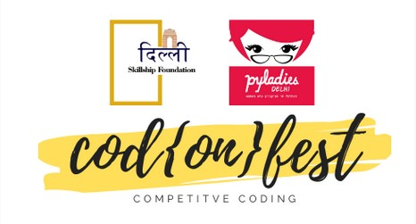

# Codonfest

[SkillShip Foundation](https://skillshipfoundation.com/) along with [PyLadies Delhi](https://www.pyladies.com/) have organized its first ever 1.5 months mentorship program in competitive programming.

This program will consist of 2 phases.

## Learning phase :

Mentees will be paired with a mentor and for the duration of 1-month participants would be provided learning material and questions of different difficulty levels which mentees need to attempt daily.

The scores and progress of participants will be recorded.

Top 3 will get goodies and additionsl benefits.

## Competitive Coding phase :

Online contests will be organized on platorms like Codechef

Winners will be chosen after considering his/her cumulative performance in both phases.

Certificates will be awarded to all participants who attempts all the questions provided by the team.

Event Description : [Codonfest](https://skillshipfoundation.com/codonfest2020/)

***
## Syllabus and Problems

[**Cod{on}fest Week 1**](Week1.html)

[**Cod{on}fest Week 2**](Week2.html)

[**Cod{on}fest Week 3**](Week3.html)

[**Cod{on}fest Week 4**](Week4.html)

*** 

 
